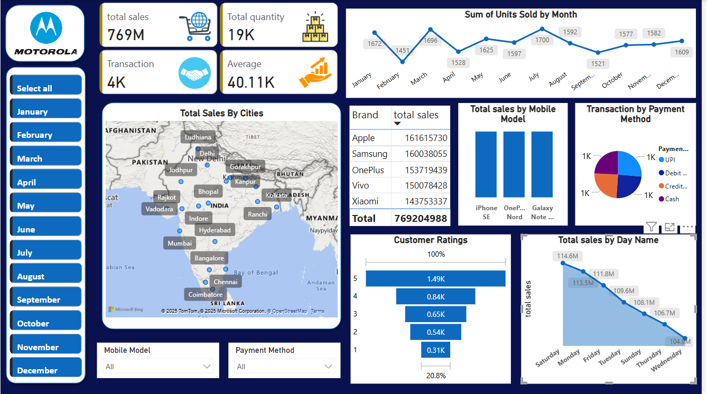

# 📱 Mobile Sales Dashboard

## Overview

An interactive Power BI dashboard designed to analyze mobile sales performance, customer behavior, and transaction trends.

## Key Insights

- Total sales and quantity sold
- Brand-wise sales performance
- City-wise sales distribution
- Monthly sales trends
- Mobile model performance
- Payment method analysis
- Customer rating distribution
- Day-wise sales performance

## Tools Used

- Microsoft Power BI
- Power Query
- DAX
- Data Visualization
- Business Analytics

## Dashboard Preview

